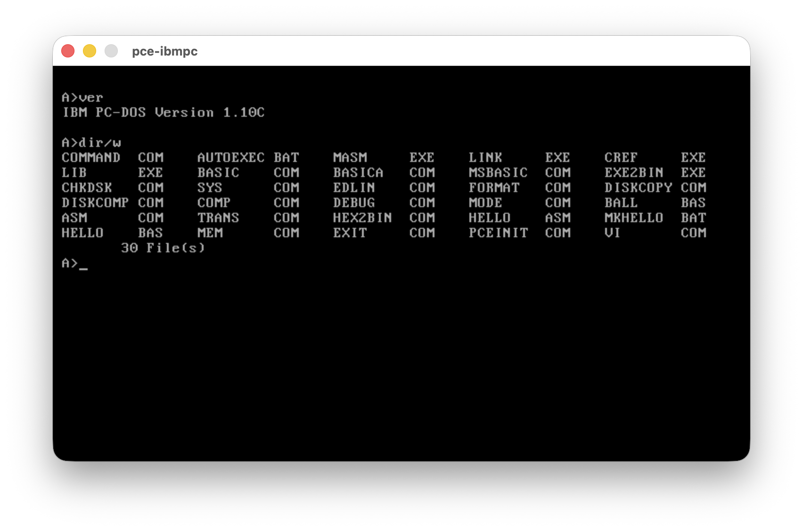
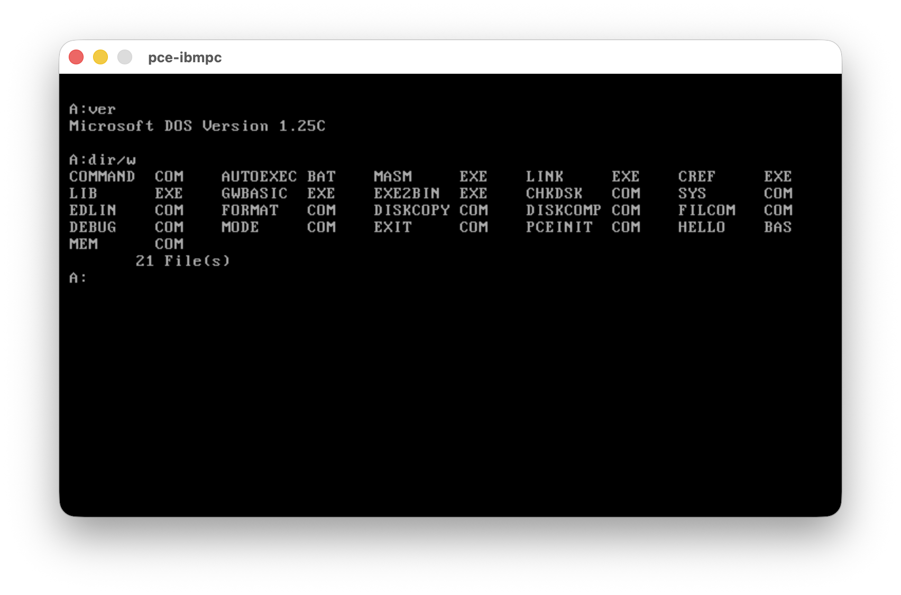
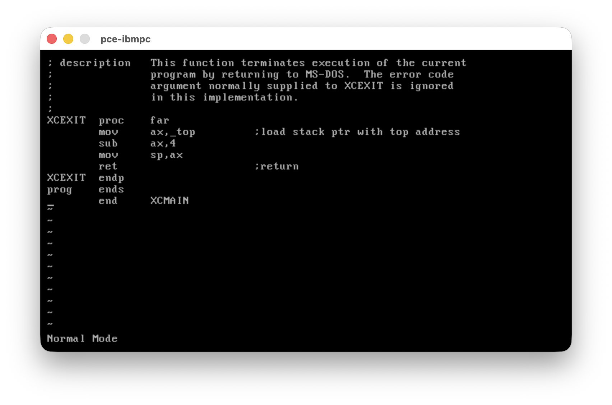
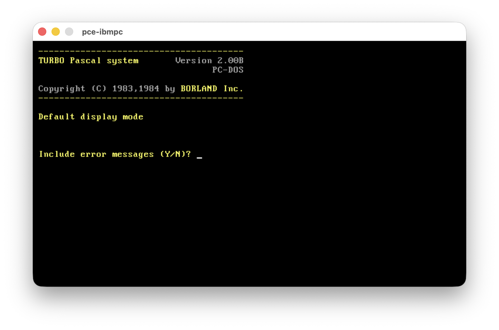

# PC-DOS 1.1 Hacking - Playing with PC-DOS 1.10 bios/dos and command.com

## Screenshots

Both flavours booting under PCE/ibmpc, with the added `ver.com` command and the extended disk content:

<table>
<tr>
<td align="center"></td>
<td align="center"></td>
</tr>
<tr>
<td align="center"><b>IBM PC-DOS 1.10C</b> (<code>pcdos_full.img</code>)</td>
<td align="center"><b>Microsoft DOS 1.25C</b> (<code>msdos_full.img</code>)</td>
</tr>
</table>

A `vi`-like editor running on PC-DOS 1.1:



## Distribution Content

### Disk Images

`make` produces eight bootable 320K floppy images, four per flavour (PC-DOS / MS-DOS).
Each variant builds on top of `*_base.img`.

| Image | Flavour | Content |
|-------|---------|---------|
| `pcdos_base.img` | PC-DOS | `ibmbio.com`, `ibmdos.com`, `command.com` only (minimal bootable system) |
| `pcdos_dist.img` | PC-DOS | Base + the original PC-DOS 1.1 distribution tools and the IBM BASIC sample programs |
| `pcdos_full.img` | PC-DOS | Base + distribution tools, `masm.exe`/`link.exe`/`cref.exe`/`lib.exe`, `basic.com`/`basica.com` and the extra utilities (`asm.com`, `trans.com`, `hex2bin.com`, `mem.com`, `hello.*` samples) |
| `pcdos_diag.img` | PC-DOS | Base + a small diagnostic set (`chkdsk.com`, `debug.com`, `edlin.com`, `mem.com`) |
| `turbo.img` | PC-DOS | Base + Turbo Pascal 2.00B (see [Turbo Pascal](#turbo-pascal) below) |
| `msdos_base.img` | MS-DOS | `io.sys`, `msdos.sys`, `command.com` only |
| `msdos_dist.img` | MS-DOS | Base + the MS-DOS 1.25 style tool set and the SCP tools (`asm.com`, `hex2bin.com`, `trans.com`) |
| `msdos_full.img` | MS-DOS | Base + tools, assembler chain, MS-BASIC and the extra utilities |
| `msdos_diag.img` | MS-DOS | Base + the small diagnostic set |

Master (pre-formatted, empty file system) images live in `disks/`: `pcdos.img`, `msdos.img`
and `blank.img`.

### Rebuilt System Components

| Binary | Source | Description |
|--------|--------|-------------|
| `ibmbio.com` | [ibmbio.asm](ibmbio.asm) | PC-DOS 1.1 BIOS, installed as `ibmbio.com` / `io.sys`, reconstructed sources |
| `ibmdos.com` | [ibmdos.asm](ibmdos.asm), [dos.asm](dos.asm) | DOS kernel, installed as `ibmdos.com` / `msdos.sys` |
| `ibmcmd.com` | [ibmcmd.asm](ibmcmd.asm), [command.asm](command.asm) | PC-DOS flavour of `command.com` (`IBMVER`) |
| `xmscmd.com` | [mscmd.asm](mscmd.asm), [command.asm](command.asm) | MS-DOS flavour of `command.com` (`MSVER`) |
| `ibmsys.com` | [ibmsys.asm](ibmsys.asm), [sys.asm](sys.asm) | `sys.com` writing the PC-DOS system files |
| `mssys.com` | [mssys.asm](mssys.asm), [sys.asm](sys.asm) | `sys.com` writing the MS-DOS system files |

[cmdorig.asm](cmdorig.asm) keeps the untouched Microsoft `command.asm` for reference;
[io.asm](io.asm) is the original 86-DOS I/O system.

### Added Utilities

| Command | Source | Description |
|---------|--------|-------------|
| `ver.com` | [ver.asm](ver.asm) | Reports the DOS version (external counterpart of the built-in) |
| `cls` | [command.asm](command.asm)| Clears the screen through the video BIOS (external counterpart of the built-in [command](command.asm#L201-L206) implemented in `command.com`) |
| `mem.com` | [mem.asm](mem.asm) | Reports conventional memory size from `INT 12h` |
| `hello.com` | [hello.asm](hello.asm), [hello.bas](hello.bas) | Minimal assembler and BASIC samples, built by [mkhello.bat](mkhello.bat) |
| `graph.bas` | [graph.bas](graph.bas) | BASICA demo plotting `f(x) = cosine(x)` in `SCREEN 2` (640x200), with arrowed axes (`pcdos_full.img` only) |

### 86-DOS Tools Rebuilt From Source

| Command | Source | Description |
|---------|--------|-------------|
| `asm.com` | [asm.asm](asm.asm) | Seattle Computer Products 8086 Assembler, Version 2.44B (Tim Paterson) |
| `hex2bin.com` | [hex2bin.asm](hex2bin.asm) | Seattle Computer Products 8086 Hex Converter, Version 1.02A |
| `trans.com` | [trans.asm](trans.asm) | Seattle Computer Products Z80 to 8086 Translator, Version 2.21A (Tim Paterson) |

### Turbo Pascal

Turbo Pascal 2.00B starting up on the system:



`turbo.img` (built from `turbo/`) carries Turbo Pascal 2.00B on top of `pcdos_base.img`:

| Files | Description |
|-------|-------------|
| `turbo.com`, `turbo-87.com` | The IDE/compiler, plain and 8087 co-processor builds |
| `tinst.com`, `tinst.msg` | Installation program used to configure `turbo.com` for the target hardware |
| `tlist.com` | Cross-reference/token list utility |
| `sound.com` | Sample compiled program |
| `*.pas` | Sample sources (`art`, `calc`, `calcmain`, `cls`, `color`, `sound`, `window`, `hilb`, `test`) |
| `*.mcs` | `calc.pas` spreadsheet sample data (`calcdemo.mcs`, `sheet.mcs`) |
| `*.doc`, `read.me`, `turbo.msg` | Original documentation and help text |

### Prebuilt Binaries (`bin/`)

Vintage third-party binaries used at build time and copied onto the images.

| Group | Files |
|-------|-------|
| Build chain | `masm.exe` (Microsoft MACRO Assembler, Version 1.10, patched), `link.exe` (IBM Personal Computer Linker, Version 1.10), `mslink.exe`, `lib.exe` (Microsoft Library Manager, Version 2.00), `cref.exe`, `exe2bin.exe` |
| Bootstrap tools | `asm.com`, `hex2bin.com`, `trans.com` |
| DOS utilities | `chkdsk.com`, `comp.com`, `debug.com`, `diskcomp.com`, `diskcopy.com`, `edlin.com`, `filcom.com`, `format.com`, `msformat.com`, `mode.com` |
| BASIC | `basic.com`, `basica.com` (IBM BASIC/BASICA, Version A1.10; require an IBM PC with the BASIC ROM, e.g. `rom/ibm-basic-1.10.rom`; PC-DOS images only), `msbasic.com` (Microsoft BASIC, Version 5.28, MS-DOS patched; `msbasic.org` is the unpatched original) |

### Emulation

[emu2-cpm86](https://github.com/johnsonjh/emu2-cpm86) is used for the build and tool testing.

| Item | Description |
|------|-------------|
| [pcdos.cfg](pcdos.cfg), [msdos.cfg](msdos.cfg) | PCE `ibmpc` machine configurations (5150, 8088, 128K, two floppy drives) |
| `pcdos`, `msdos` | Shell wrappers running the matching image under PCE |
| `rom/` | IBM PC BIOS 1982-10-27, IBM Cassette BASIC 1.10, EGA/VGA option ROMs and the PCE extension ROM |
| [Makefile](Makefile), [Makefile.dos](Makefile.dos) | Host (Linux/macOS, via `emu2` + `mtools`) and native DOS build scripts |

## Sources

The experiment started from the vintage MS-DOS code opened by Microsoft:

https://github.com/microsoft/MS-DOS/blob/master/v1.25/source/COMMAND.ASM

ibmbio.com sources are retrieved from https://www.os2museum.com/wp/pc-dos-1-1-from-scratch

## MIT License (In line with Source License):

- https://github.com/tsupplis/pcdos11-hacking/blob/master/LICENSE.md
- https://github.com/microsoft/MS-DOS/blob/master/LICENSE.md

## First Contact

There is a first failure on EQU symbol redefined. This prevents compilation.

```
156c156
< ZERO    EQU     $
---
> ZERO    =       $
```

To get to the official PC-DOS binary production:

A triple NOP replaces the MS instruction MOV [COMFCB],AL. This change fixes reload from command.com
on drive A: by not overriding the first FCB byte with 0 (Default drive).

```
469a474,479
>         IF IBMVER
>         NOP
>         NOP
>         NOP
>         ENDIF
>         IF MSVER
470a481
>         ENDIF
2166d2176
< 
```

The 2 previous changes allow recreation of the PC-DOS exact command.com, when MSVER is set to FALSE and
IBMVER is set to TRUE

A third small change has been added in MSVER mode, before opening the command.com file. To be checked if
this is really necessary ...

```
>         IF MSVER
>         MOV     AL, 0
>         MOV     [COMFCB], AL
>         ENDIF
```

Those variations beetween IBM and Microsoft seem to be linked to the command.com file being searched on
the default drive (Microsoft) or on drive A: (IBM).

## Configs

- msdosenh: slightly enhanced PC-DOS 1.1 command.com marked as 1.25A/1.17A
    - VER command
    - Addition of command.com search on A: after default drive search failed
- msdosorg: MS-DOS 1.25 command 1.17 vanilla command.com rebuilt
    - Addition of FCB Drive 0'ing from Zenith ZDOS before opening command.com
- pcdosenh: slightly enhanced PC-DOS 1.1 command.com marked as 1.10A
    - VER command
    - CLS command (BIOS)
    - Check for command in A: if not found
    - External MEM command
- pcdosorg: PC-DOS 1.1 command.com rebuilt 
    - Checked against PC-DOS 1.1 distribution 
    - https://github.com/microsoft/MS-DOS/blob/master/v1.25/bin/COMMAND.COM
    - SHA256(pcdosorg.com)= 84034261608f7b9d38a6b81b6896bb5cc45dc5ebfae0b0927081f86f354aa571

## TODO: Other little changes

- pcdosenh:
    - Search path on A: if default drive seach fails
    - Investigate further other MS-DOS 1.25 variations
- bios and dos
- format.com has been patch to format disk that can work with all emulators including qemu. the signature 55AA is added at the end of the 512 byte boot sector.

## Build/Test Dependencies

### Linux/macOS

- pce emulator (test)
- emu2 (for build from macosx/linux)
- pc-dos 1.1 floppy image (for test if available)
- exe2bin.exe from https://github.com/microsoft/MS-DOS/blob/master/v1.25/bin/EXE2BIN.EXE
- ibm link.exe 1.10 from https://github.com/microsoft/MS-DOS/blob/master/v1.25/bin/LINK.EXE
- microsoft masm.exe 1.10 (patched, cf below) https://github.com/microsoft/MS-DOS/blob/master/v2.0/bin/MASM.EXE

### DOS

- exe2bin.exe from https://github.com/microsoft/MS-DOS/blob/master/v1.25/bin/EXE2BIN.EXE
- ibm link.exe from https://github.com/microsoft/MS-DOS/blob/master/v1.25/bin/LINK.EXE
- microsoft masm.exe 1.10 (patched, cf below) https://github.com/microsoft/MS-DOS/blob/master/v2.0/bin/MASM.EXE

## Build

- Use Makefile on Linux, macOS
- Use Makefile.dos on Win32, DOS (builds only PC-DOS configs)

## MASM Fix

The 1.10 version of MASM part of the MS-DOS 2.00 distribution hangs on emulators, including dosbox and emu2. 

There is a detailed explanation at: https://slions.net/threads/debugging-ibm-macro-assembler-version-1-00.33/

The execution of the Faulty code looks like this:

```
11AD:0000 B83B0F           MOV     AX,0F3B
11AD:0003 8ED8             MOV     DS,AX
11AD:0005 8C062400         MOV     [0024],ES
11AD:0009 FA               CLI
11AD:000A 8ED0             MOV     SS,AX
11AD:000C 268B1E0200       MOV     BX,ES:[0002]
11AD:0011 2BD8             SUB     BX,AX
11AD:0013 81FB0010         CMP     BX,1000
11AD:0017 7E03             JLE     001C
```

The fix is just about changing the JLE into JBE (7E03 -> 7603)

```
11AD:0000 B83B0F           MOV     AX,0F3B
11AD:0003 8ED8             MOV     DS,AX
11AD:0005 8C062400         MOV     [0024],ES
11AD:0009 FA               CLI
11AD:000A 8ED0             MOV     SS,AX
11AD:000C 268B1E0200       MOV     BX,ES:[0002]
11AD:0011 2BD8             SUB     BX,AX
11AD:0013 81FB0010         CMP     BX,1000
11AD:0017 7603             JBE     001C
```

The masm binary checked in git is fixed.

--

## Companion projects

| Project | Description |
|---------|-------------|
| [cpm86-kernel](https://github.com/tsupplis/cpm86-kernel)     | CP/M-86 1.1 distribution rebuilt from patched and reconstituted sources |
| [ccpm86-y2k](https://github.com/tsupplis/ccpm86-y2k)         | CCP/M-86 3.1 distribution rebuilt from patched and reconstituted sources |
| [cpm86-crossdev](https://github.com/tsupplis/cpm86-crossdev) | Unix CP/M-86 and DOS cross development project (compilers, emulation and tools) |
| [cpm86-hacking](https://github.com/tsupplis/cpm86-hacking)   | CP/M-86 and DOS miscellaneous tools and PCE emulator helpers |
| [cpm86-cmdtools](https://github.com/tsupplis/cpm86-cmdtools) | CP/M-86 `.cmd` file manipulation tools |
| [cpm86-ports](https://github.com/tsupplis/cpm86-ports)       | CP/M-86 application ports in C and assembler |
| [cpm86-vi](https://github.com/tsupplis/cpm86-vi)             | STevie vi port for CP/M-86 and PC-DOS 1.1 |
| [pcdos11-hacking](https://github.com/tsupplis/pcdos11-hacking) | PC-DOS 1.1 distribution, tools and notes |


